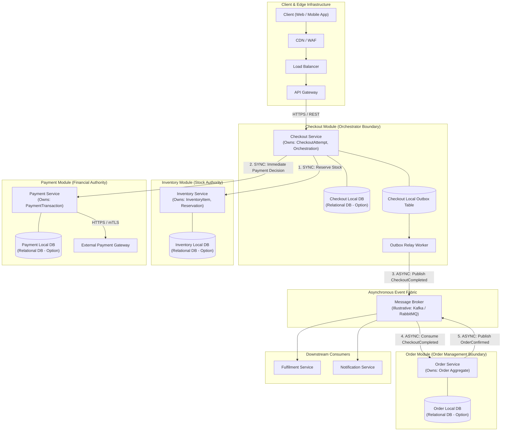

# 03_LLD: Service & Communication Boundaries

## 1. Domain Overview & Macro-Alignment
In alignment with the finalized **Member 1 High-Level Architecture Contract**, the core purchase journey is orchestrated by the **Checkout Service**. 

* **The Ingress Pipeline**:
  $$\text{Client} \longrightarrow \text{CDN / WAF} \longrightarrow \text{Load Balancer} \longrightarrow \text{API Gateway} \longrightarrow \text{Checkout Service}$$
* **Checkout Orchestrator**: The **Checkout Service** serves as the sole coordinator for the critical synchronous path, interfacing with Cart/Sale, Inventory, and Payment.
* **Asynchronous Order Creation**: The **Order Service** does **not** orchestrate checkout or reserve inventory. Instead, it asynchronously consumes the `CheckoutCompleted` event emitted from the Checkout Service's local Transactional Outbox via the Message Broker to instantiate and manage the permanent `Order` aggregate.

> [!NOTE]
> **Technology Neutrality Note**: Data stores and message brokers are specified as conceptual architectural requirements (e.g., *Relational Database*, *Message Broker*, *Distributed Cache*). Concrete technologies like PostgreSQL, Apache Kafka, RabbitMQ, or Redis represent illustrative technology options; final infrastructure configurations are governed by Member 1 and Member 4.

---

## 2. Service Boundary Specifications & Domain Ownership

### 2.1. Checkout Service (Orchestration Boundary)
* **Bounded Context Responsibility**:
  * Handling incoming checkout requests from the API Gateway.
  * Enforcing checkout request idempotency via deterministic client keys (`Idempotency-Key`).
  * Coordinating the synchronous inventory reservation call and the synchronous payment authorization/charge call.
  * Managing the `CheckoutAttempt` state machine.
  * Writing the `CheckoutCompleted` domain event to its **strictly local Transactional Outbox** within the local database transaction upon successful payment.
  * Coordinating recovery handoffs during ambiguous network timeouts.
* **Explicit Non-Responsibilities**:
  * Does **not** own authoritative stock or ledger counts.
  * Does **not** own the authoritative payment transaction records.
  * Does **not** own the permanent `Order` aggregate lifecycle or customer fulfillment.
* **Data Boundary**: Isolated schema `checkout_db` owning `checkout_attempts` and `checkout_outbox`. Has zero direct access to Inventory DB, Payment DB, or Order DB.

### 2.2. Inventory Service (Stock & Reservation Authority)
* **Bounded Context Responsibility**:
  * Authoritative ownership of stock levels, SKU counts, and active holds.
  * Synchronous execution of stock reservations with Time-To-Live (TTL) expiration guarantees.
  * Sole authority for releasing expired or cancelled holds back to the available pool.
  * Guaranteeing that no more than the physical/configured units (e.g., 100 units during flash sales) can be reserved under peak concurrency.
* **Explicit Non-Responsibilities**:
  * Does **not** coordinate payment or order placement.
* **Concurrency Boundary**: Detailed concurrency-control mechanisms (e.g., pessimistic locks, optimistic versions, or token buckets) are modeled as pluggable strategies in LLD; final concurrency selection is owned by **Member 4**.
* **Data Boundary**: Isolated `inventory_db` owning `inventory_items` and `reservations`.

### 2.3. Payment Service (Financial Processing Authority)
* **Bounded Context Responsibility**:
  * Authoritative owner of payment transaction states (`INITIATED`, `AUTHORIZED`, `CAPTURED`, `DECLINED`, `FAILED`).
  * Direct integration with external payment gateways (e.g., Stripe, Adyen) via resilient gateway adapters.
  * Providing a synchronous API for immediate payment authorization/charge decisions to the Checkout Service.
  * Ingesting asynchronous gateway webhooks (e.g., 3D-Secure settlement callbacks).
  * Managing payment idempotency to prevent duplicate bank charges.
  * Executing status reconciliation and recovery queries for dropped or timed-out gateway calls.
* **Explicit Non-Responsibilities**:
  * Does **not** manage inventory reservations or create orders.
* **Data Boundary**: Encrypted, PCI-compliant `payments_db` owning `payment_transactions` and audit logs.

### 2.4. Order Service (Order Management Authority)
* **Bounded Context Responsibility**:
  * Asynchronous consumer of the `CheckoutCompleted` event from the Message Broker.
  * Creation and persistence of the authoritative `Order` aggregate (`OrderItem`, `DeliveryAddress`, `OrderStatus`).
  * Management of post-purchase lifecycles (`CONFIRMED`, `PROCESSING`, `SHIPPED`, `DELIVERED`, `CANCELLED`).
  * Publishing the `OrderConfirmed` domain event to the Message Broker for downstream Fulfilment and Notification services.
* **Explicit Non-Responsibilities**:
  * Does **not** orchestrate checkout.
  * Does **not** execute inventory reservations.
  * Does **not** make synchronous payment calls or interface with payment gateways.
* **Data Boundary**: Isolated `orders_db` owning orders and order line items.

---

## 3. Communication Protocol Boundaries: Synchronous vs. Asynchronous

| Interaction Vector | Source | Target | Protocol Mode | Semantic Contract / Payload | Justification & Guarantees |
| :--- | :--- | :--- | :--- | :--- | :--- |
| **Validate & Reserve Stock** | Checkout Service | Inventory Service | **Synchronous (gRPC / REST)** | `ReserveStock(checkout_id, items, ttl)` | Sub-15ms blocking call. Checkout must confirm physical hold before taking payment. |
| **Immediate Payment Decision** | Checkout Service | Payment Service | **Synchronous (REST / HTTPS)** | `POST /v1/payments (Idempotency-Key, Amount, Token)` | Blocking call. Immediate synchronous authorization or decline is required to respond to customer. |
| **Emit CheckoutCompleted** | Checkout Service | Local Outbox Table | **Synchronous (Local DB ACID)** | `INSERT INTO checkout_outbox (...)` | Atomic commit alongside `CheckoutAttempt` state update. Prevents dual-write bugs without 2PC. |
| **Relay to Message Broker** | Outbox Relay | Message Broker | **Asynchronous (Poller / CDC)** | `Topic: checkout.events` | Decouples Checkout Service from downstream consumers. At-least-once delivery guarantee. |
| **Create & Persist Order** | Message Broker | Order Service | **Asynchronous (Consumer)** | Event: `CheckoutCompleted` | Order creation happens off the critical path, keeping checkout latency ultra-lean. |
| **Publish OrderConfirmed** | Order Service | Message Broker | **Asynchronous (Producer)** | Event: `OrderConfirmed` | Triggers fulfillment dispatch and customer email/SMS notifications. |
| **Compensate Reservation (Failure/Timeout)** | Checkout / Payment | Inventory Service | **Sync or Async (Event/RPC)** | `ReleaseReservation(reservation_id)` | Restores stock back to available pool if payment fails or times out. |

---

## 4. Reliability & Transactional Guarantee Mechanisms

### 4.1. Local Transactional Outbox (Strictly Local to Checkout)
To ensure reliable event propagation without distributed two-phase commits (2PC):
1. When Payment Service returns a successful synchronous decision, the Checkout Service writes `CheckoutCompleted` into its **local `checkout_outbox` table** inside the **same local ACID database transaction** that updates the `CheckoutAttempt` to `SUCCESS`.
2. An **Outbox Relay** (e.g., background poller or CDC process) reads unpublished events from `checkout_outbox` and publishes them to the Message Broker.
3. The Order Service consumes `CheckoutCompleted` idempotently using the unique `checkout_id`.

### 4.2. Failure & Reconciliation Boundary: Payment Success + Checkout Crash
A critical failure window identified by Member 1:
$$\text{Payment Gateway Succeeds} \longrightarrow \text{Payment Service Records SUCCESS} \longrightarrow \text{Checkout Crashes before Outbox Write}$$
* **Recovery Mechanism**:
  1. Payment Service is the authoritative owner of the payment transaction and has durably stored `SUCCESS`.
  2. When the client retries with the same `Idempotency-Key`, or when a background Checkout Reconciliation Job inspects pending checkout attempts, Checkout queries `PaymentService.getPaymentStatus(checkout_id)`.
  3. Upon receiving the verified `SUCCESS` status from Payment Service, the Checkout Service resumes execution, marks the `CheckoutAttempt` as `SUCCESS`, and writes `CheckoutCompleted` to its local Transactional Outbox.
  4. No distributed transaction (2PC) or shared database is used. Each service maintains its own isolated database boundary.
