# 03_LLD: Detailed Domain Class Diagrams

## 1. Architectural Overview & Domain Modeling
In alignment with the finalized **Member 1 High-Level Architecture Contract**, this document details the object models, entity boundaries, and dependency directions across the four interacting domain packages:
1. **Checkout Service** (Orchestration Boundary, Client Handlers, Local Outbox)
2. **Inventory Service** (Authoritative Stock & Reservation Boundary)
3. **Payment Service** (Authoritative Financial Transaction & Gateway Boundary)
4. **Order Service** (Asynchronous Order Aggregate & Post-Purchase Boundary)

### Strict Boundary & Dependency Principles
* **Zero Cross-Service DB Coupling**: Checkout does **not** access the Inventory or Payment databases. It communicates exclusively via `IInventoryClient` and `IPaymentClient` interface abstractions.
* **Separation of Concerns**: `OrderService` does **not** orchestrate checkout or reserve stock. It only instantiates the `Order` aggregate upon consuming the `CheckoutCompleted` event from the Message Broker.
* **Pluggable Inventory Concurrency**: Concurrency strategies in Inventory are structured as illustrative strategies behind `IInventoryConcurrencyStrategy`; final selection is defined by **Member 4**.

---

## 2. Comprehensive Class Diagram (Mermaid.js)

```mermaid
classDiagram
    direction TB

    %% ==========================================
    %% CHECKOUT SERVICE DOMAIN (ORCHESTRATOR)
    %% ==========================================
    namespace Checkout_Domain {
        class CheckoutAttemptId {
            -String value
            +getValue() String
        }

        class CheckoutStatus {
            <<enumeration>>
            INITIATED
            RESERVING_INVENTORY
            INVENTORY_RESERVED
            PROCESSING_PAYMENT
            SUCCESS
            FAILED_OUT_OF_STOCK
            FAILED_PAYMENT_DECLINED
            FAILED_TIMEOUT
        }

        class CheckoutAttempt {
            <<aggregate root>>
            -CheckoutAttemptId id
            -String idempotencyKey
            -String customerId
            -CheckoutStatus status
            -Money totalAmount
            -String reservationId
            -String paymentTransactionId
            -DateTime createdAt
            -DateTime updatedAt
            +markStockReserved(resId: String) void
            +markPaymentSuccess(txId: String) void
            +markFailed(status: CheckoutStatus, reason: String) void
            +isCompleted() Boolean
        }

        class CheckoutOrchestrator {
            <<domain orchestrator>>
            -IInventoryClient inventoryClient
            -IPaymentClient paymentClient
            -ICheckoutRepository checkoutRepo
            -ICheckoutOutboxRepository outboxRepo
            +executeCheckout(command: CheckoutCommand): CheckoutResult
            +handleRecovery(attemptId: CheckoutAttemptId): CheckoutResult
        }

        class IInventoryClient {
            <<interface (Port)>>
            +reserve(checkoutId: String, items: List, ttlSec: Int): ReservationClientResult
            +release(reservationId: String): void
        }

        class IPaymentClient {
            <<interface (Port)>>
            +processPayment(checkoutId: String, amount: Money, token: String): PaymentClientResult
            +getPaymentStatus(checkoutId: String): PaymentClientResult
        }

        class ICheckoutRepository {
            <<interface>>
            +save(attempt: CheckoutAttempt): void
            +findByIdempotencyKey(key: String): CheckoutAttempt
            +findById(id: CheckoutAttemptId): CheckoutAttempt
        }

        class ICheckoutOutboxRepository {
            <<interface>>
            +saveOutboxEvent(event: CheckoutCompletedEvent): void
        }
    }

    %% ==========================================
    %% INVENTORY SERVICE DOMAIN (STOCK AUTHORITY)
    %% ==========================================
    namespace Inventory_Domain {
        class SkuId {
            -String skuCode
            +getSkuCode() String
            +equals(other: SkuId) Boolean
        }

        class ReservationId {
            -String reservationUuid
            +getValue() String
        }

        class ReservationStatus {
            <<enumeration>>
            HELD
            COMMITTED
            RELEASED
            EXPIRED
        }

        class Reservation {
            <<entity>>
            -ReservationId id
            -String checkoutId
            -SkuId skuId
            -Quantity quantity
            -ReservationStatus status
            -DateTime expiresAt
            -DateTime createdAt
            +isExpired() Boolean
            +commit() void
            +release() void
        }

        class InventoryItem {
            <<aggregate root>>
            -SkuId skuId
            -Int totalStock
            -Int reservedStock
            -Int availableStock
            -Long version
            +hasAvailable(qty: Quantity) Boolean
            +applyReservation(res: Reservation) void
            +releaseReservation(res: Reservation) void
            +commitDeduction(res: Reservation) void
        }

        class IInventoryConcurrencyStrategy {
            <<interface (Illustrative - Member 4 Authority)>>
            +tryReserve(skuId: SkuId, qty: Quantity, ttl: Int): Reservation
            +releaseHold(reservationId: ReservationId): void
        }

        class IInventoryRepository {
            <<interface>>
            +findBySku(skuId: SkuId): InventoryItem
            +save(item: InventoryItem): void
        }

        class IReservationRepository {
            <<interface>>
            +save(res: Reservation): void
            +findById(id: ReservationId): Reservation
            +findActiveByCheckoutId(checkoutId: String): List~Reservation~
        }

        class InventoryService {
            <<domain service>>
            -IInventoryRepository invRepo
            -IReservationRepository resRepo
            -IInventoryConcurrencyStrategy concurrencyStrategy
            +reserveStock(checkoutId: String, items: List, ttl: Int): ReservationResult
            +releaseStock(reservationId: ReservationId): void
            +commitStock(checkoutId: String): void
        }
    }

    %% ==========================================
    %% PAYMENT SERVICE DOMAIN (FINANCIAL AUTHORITY)
    %% ==========================================
    namespace Payment_Domain {
        class PaymentId {
            -String id
            +getValue() String
        }

        class TransactionRef {
            -String externalGatewayRef
            +getRef() String
        }

        class PaymentStatus {
            <<enumeration>>
            INITIATED
            PENDING_3DS
            AUTHORIZED
            CAPTURED
            FAILED
            DECLINED
            REFUNDED
        }

        class PaymentTransaction {
            <<aggregate root>>
            -PaymentId paymentId
            -String checkoutId
            -Money amount
            -PaymentStatus status
            -TransactionRef externalRef
            -DateTime createdAt
            -DateTime settledAt
            +markAuthorized(ref: TransactionRef) void
            +markCaptured(ref: TransactionRef) void
            +markDeclined(reason: String) void
            +markFailed(err: String) void
        }

        class IPaymentGatewayAdapter {
            <<interface>>
            +authorizeAndCapture(amount: Money, token: String, idempotencyKey: String): GatewayResult
            +queryStatus(externalRef: TransactionRef): GatewayResult
            +refund(externalRef: TransactionRef, amount: Money): GatewayResult
        }

        class IPaymentRepository {
            <<interface>>
            +save(tx: PaymentTransaction): void
            +findById(id: PaymentId): PaymentTransaction
            +findByCheckoutId(checkoutId: String): PaymentTransaction
        }

        class PaymentService {
            <<domain service>>
            -IPaymentRepository paymentRepo
            -IPaymentGatewayAdapter gatewayAdapter
            +processPayment(checkoutId: String, amount: Money, token: String, key: String): PaymentResult
            +reconcilePaymentStatus(checkoutId: String): PaymentResult
            +handleWebhook(payload: String, signature: String): void
        }
    }

    %% ==========================================
    %% ORDER SERVICE DOMAIN (ORDER MANAGEMENT)
    %% ==========================================
    namespace Order_Domain {
        class OrderId {
            -String value
            +getValue() String
            +equals(other: OrderId) Boolean
        }

        class OrderStatus {
            <<enumeration>>
            CONFIRMED
            PROCESSING
            SHIPPED
            DELIVERED
            CANCELLED
            REFUNDED
        }

        class OrderItem {
            <<entity>>
            -String itemId
            -SkuId skuId
            -Quantity quantity
            -Money unitPrice
            +calculateSubtotal() Money
        }

        class DeliveryAddress {
            <<value object>>
            -String streetAddress
            -String city
            -String state
            -String postalCode
            -String countryIso
        }

        class Order {
            <<aggregate root>>
            -OrderId id
            -String checkoutId
            -String customerId
            -OrderStatus status
            -List~OrderItem~ items
            -DeliveryAddress deliveryAddress
            -Money totalAmount
            -DateTime confirmedAt
            +markProcessing() void
            +markShipped(trackingNum: String) void
            +markDelivered() void
            +cancel(reason: String) void
        }

        class IOrderRepository {
            <<interface>>
            +save(order: Order): void
            +findById(id: OrderId): Order
            +findByCheckoutId(checkoutId: String): Order
        }

        class OrderConfirmedPublisher {
            <<domain event publisher>>
            +publish(order: Order): void
        }

        class OrderService {
            <<domain service>>
            -IOrderRepository orderRepo
            -OrderConfirmedPublisher publisher
            +createOrderFromCheckout(event: CheckoutCompletedEvent): Order
            +updateOrderStatus(orderId: OrderId, status: OrderStatus): void
        }
    }

    %% Shared Value Objects
    class Money {
        <<value object>>
        -BigDecimal amount
        -String currency
        +add(other: Money) Money
        +subtract(other: Money) Money
        +getAmount() BigDecimal
    }

    class Quantity {
        <<value object>>
        -Int units
        +getUnits() Int
    }

    %% ==========================================
    %% RELATIONSHIPS & DEPENDENCY INVERSION
    %% ==========================================
    CheckoutOrchestrator ..> IInventoryClient : invokes (Port)
    CheckoutOrchestrator ..> IPaymentClient : invokes (Port)
    CheckoutOrchestrator ..> ICheckoutRepository : persists
    CheckoutOrchestrator ..> ICheckoutOutboxRepository : appends outbox
    CheckoutAttempt "1" *-- "1" CheckoutStatus : state

    InventoryService ..> IInventoryRepository : queries/updates
    InventoryService ..> IReservationRepository : persists
    InventoryService ..> IInventoryConcurrencyStrategy : delegates
    InventoryItem "1" *-- "0..*" Reservation : tracks
    Reservation "1" *-- "1" ReservationStatus : lifecycle

    PaymentService ..> IPaymentRepository : persists
    PaymentService ..> IPaymentGatewayAdapter : delegates
    PaymentTransaction "1" *-- "1" PaymentStatus : lifecycle

    OrderService ..> IOrderRepository : persists
    OrderService ..> OrderConfirmedPublisher : triggers
    Order "1" *-- "1..*" OrderItem : contains
    Order "1" *-- "1" DeliveryAddress : ships to
    Order "1" *-- "1" OrderStatus : lifecycle
```

---

## 3. Entity, Value Object & Service Breakdown

### 3.1. Checkout Service Components
1. **`CheckoutAttempt` (Aggregate Root)**:
   * Encapsulates the runtime lifecycle of a customer purchase attempt (`INITIATED`, `RESERVING_INVENTORY`, `INVENTORY_RESERVED`, `PROCESSING_PAYMENT`, `SUCCESS`, `FAILED_*`).
   * Enforces client checkout request idempotency via `idempotencyKey`.
2. **`CheckoutOrchestrator`**:
   * Encapsulates the execution of the critical synchronous path (reserve stock via `IInventoryClient` $\rightarrow$ authorize payment via `IPaymentClient` $\rightarrow$ write `CheckoutCompleted` to `ICheckoutOutboxRepository`).
3. **`IInventoryClient` & `IPaymentClient`**:
   * Inversion-of-Control Ports ensuring Checkout has **zero direct coupling** to internal database schemas of Inventory or Payment.

### 3.2. Inventory Service Components
1. **`InventoryItem` (Aggregate Root)**:
   * Authoritative owner of physical stock counts (`totalStock`, `reservedStock`, `availableStock`).
   * Guarantees invariant: `availableStock = totalStock - reservedStock >= 0`.
2. **`Reservation` (Entity)**:
   * Tracks temporary holds with explicit `expiresAt` timestamps.
3. **`IInventoryConcurrencyStrategy`**:
   * Strategy interface demonstrating pluggable concurrency approaches (*e.g., Optimistic versioning, Redis token buckets, or DB row locks*).
   * **Explicit Architecture Boundary**: Defined as illustrative alternatives; final concurrency implementation is owned by **Member 4**.

### 3.3. Payment Service Components
1. **`PaymentTransaction` (Aggregate Root)**:
   * Authoritative owner of financial transaction records.
   * Tracks discrete lifecycle states (`INITIATED`, `AUTHORIZED`, `CAPTURED`, `DECLINED`, `FAILED`).
2. **`IPaymentGatewayAdapter`**:
   * Polymorphic port isolating domain code from third-party vendor SDKs (Stripe, Adyen, etc.).
3. **`PaymentService`**:
   * Executes synchronous payment decisions, processes asynchronous gateway webhooks, and handles status recovery queries.

### 3.4. Order Service Components
1. **`Order` (Aggregate Root)**:
   * Created **asynchronously** upon consuming `CheckoutCompleted`.
   * Governs order fulfillment lifecycle (`CONFIRMED`, `PROCESSING`, `SHIPPED`, `DELIVERED`, `CANCELLED`).
   * Snapshots line item prices, customer address, and total amount.
2. **`OrderConfirmedPublisher`**:
   * Publishes the `OrderConfirmed` domain event to the Message Broker for downstream Fulfilment and Notification services.
