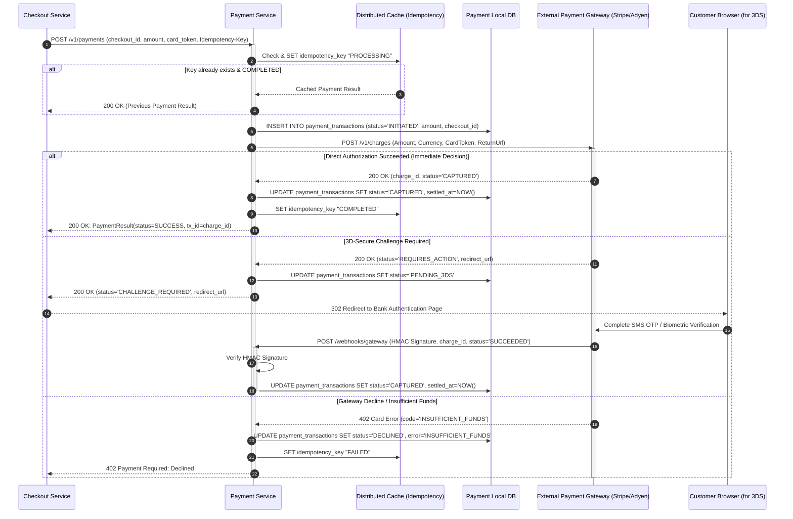

# 03_LLD: Core Execution Sequence Diagrams

## 1. Scope & Architectural Alignment
In strict alignment with the **Member 1 High-Level Architecture Contract**:
* **The Checkout Service is the sole Checkout Orchestrator** for the synchronous purchase flow.
* **The Synchronous Critical Path**: `Checkout -> Inventory Service (SYNC)` $\longrightarrow$ `Checkout -> Payment Service (SYNC)` $\longrightarrow$ `Checkout writes CheckoutCompleted to Local Outbox`.
* **The Asynchronous Path**: `Checkout Outbox -> Outbox Relay -> Message Broker -> Order Service (ASYNC)` $\longrightarrow$ `Order Service persists Order -> Publishes OrderConfirmed -> Broker -> Fulfilment & Notification`.
* **Order Service does NOT orchestrate checkout**, does not reserve inventory, and does not invoke payment gateways.

---

## 2. Sequence Diagram 1: Purchase & Reservation Flow (End-to-End Orchestrated Checkout)

```mermaid
sequenceDiagram
    autonumber
    actor Customer as User / Client App
    participant APIGW as API Gateway
    participant CheckoutSvc as Checkout Service (Orchestrator)
    participant CheckoutDB as Checkout Local DB & Outbox
    participant InvSvc as Inventory Service
    participant PaySvc as Payment Service
    participant Relay as Outbox Relay Worker
    participant Broker as Message Broker (Kafka / RabbitMQ)
    participant OrderSvc as Order Service
    participant Downstream as Fulfilment & Notification

    %% Ingress
    Customer->>APIGW: POST /api/v1/checkout (Items, PaymentToken, Idempotency-Key)
    activate APIGW
    APIGW->>CheckoutSvc: ExecuteCheckout(Command)
    activate CheckoutSvc

    %% Checkout Initialization
    CheckoutSvc->>CheckoutDB: INSERT INTO checkout_attempts (status='INITIATED')

    %% [SYNC] Step 1: Synchronous Inventory Reservation
    critical [SYNC] Synchronous Inventory Reservation
        CheckoutSvc->>InvSvc: gRPC/REST: ReserveStock(checkout_id, items, reservation_ttl)
        activate InvSvc
        Note over InvSvc: Concurrency strategy applied<br/>(Authority: Member 4)
        
        alt Stock Available
            InvSvc-->>CheckoutSvc: 200 OK: ReservationResult(status=HELD, res_id="res_99")
            CheckoutSvc->>CheckoutDB: UPDATE checkout_attempts SET status='INVENTORY_RESERVED'
        else Out of Stock
            InvSvc-->>CheckoutSvc: 409 Conflict: Out of Stock
            CheckoutSvc->>CheckoutDB: UPDATE checkout_attempts SET status='FAILED_OUT_OF_STOCK'
            CheckoutSvc-->>APIGW: 409 Conflict: Items Out of Stock
            APIGW-->>Customer: 409 Conflict: Items Out of Stock
        end
        deactivate InvSvc
    end

    %% [SYNC] Step 2: Synchronous Payment Decision
    critical [SYNC] Synchronous Payment Processing
        CheckoutSvc->>PaySvc: POST /v1/payments (checkout_id, amount, token, Idempotency-Key)
        activate PaySvc
        Note over PaySvc: Authoritative financial transaction<br/>& Gateway interaction
        PaySvc-->>CheckoutSvc: 200 OK: PaymentResult(status=SUCCESS, tx_id="tx_123")
        deactivate PaySvc
    end

    %% Step 3: Atomic Local Commit & Outbox Write
    critical Local Atomic Transaction (Checkout Boundary)
        CheckoutSvc->>CheckoutDB: UPDATE checkout_attempts SET status='SUCCESS'<br/>AND INSERT INTO checkout_outbox (event='CheckoutCompleted')
    end

    CheckoutSvc-->>APIGW: 200 OK (checkout_id, status='SUCCESS')
    deactivate CheckoutSvc
    APIGW-->>Customer: 200 OK: Payment successful; order creation pending
    deactivate APIGW

    %% [ASYNC] Step 4: Asynchronous Relay & Order Processing
    par [ASYNC] Event Relay to Broker
        Relay->>CheckoutDB: Poll unpublished outbox events
        Relay->>Broker: Publish "CheckoutCompleted" (Topic: checkout.events)
        Relay->>CheckoutDB: Mark outbox event as PROCESSED
    and [ASYNC] Order Generation
        Broker--)OrderSvc: Consume "CheckoutCompleted"
        activate OrderSvc
        Note over OrderSvc: Order Service asynchronously creates & manages Order
        OrderSvc->>OrderSvc: Construct Order aggregate & persist to Order DB
        OrderSvc->>Broker: Publish "OrderConfirmed" (Topic: order.events)
        deactivate OrderSvc
        
        Broker--)Downstream: Trigger Fulfilment Dispatch & Customer Notifications
    end
```

---

## 3. Sequence Diagram 2: Critical Payment Processing Flow

This workflow illustrates how the **Payment Service** authoritatively governs payment transactions, enforces idempotency, interacts with third-party gateways (including 3D-Secure challenges and webhooks), and returns the synchronous decision to the **Checkout Service**.



---

## 4. Sequence Diagram 3: Recovery Flow (Payment Success + Checkout Crash)

This sequence explicitly models the critical failure window defined in Member 1's architecture:
$$\text{Payment Service records durable SUCCESS} \longrightarrow \text{Checkout crashes before Outbox Write} \longrightarrow \text{Reconciliation Resumes Checkout}$$

```mermaid
sequenceDiagram
    autonumber
    actor Customer as User / Retrying Client
    participant CheckoutSvc as Checkout Service (Recovering)
    participant CheckoutDB as Checkout Local DB & Outbox
    participant PaySvc as Payment Service
    participant PayDB as Payment Local DB
    participant Relay as Outbox Relay Worker
    participant Broker as Message Broker
    participant OrderSvc as Order Service

    Note over CheckoutSvc,PaySvc: FAILURE WINDOW OCCURRED:<br/>Payment succeeded at Gateway, PayDB has status='CAPTURED',<br/>but Checkout node crashed before writing checkout_outbox!

    %% Client Retry or Background Reconciler
    Customer->>CheckoutSvc: POST /api/v1/checkout (Same Idempotency-Key)
    activate CheckoutSvc
    CheckoutSvc->>CheckoutDB: SELECT * FROM checkout_attempts WHERE idempotency_key = ...
    Note over CheckoutSvc: Status found: 'PROCESSING_PAYMENT' (Unsettled local state)

    %% Status Reconciliation Call
    CheckoutSvc->>PaySvc: GET /v1/payments/status?checkout_id=chk_123
    activate PaySvc
    PaySvc->>PayDB: SELECT status, tx_id FROM payment_transactions WHERE checkout_id = 'chk_123'
    PayDB-->>PaySvc: Found record: status='CAPTURED', tx_id='tx_999'
    PaySvc-->>CheckoutSvc: 200 OK: PaymentStatusResponse(status=SUCCESS, tx_id='tx_999')
    deactivate PaySvc

    %% Resume Checkout Outbox Write
    critical Local Recovery Transaction
        CheckoutSvc->>CheckoutDB: UPDATE checkout_attempts SET status='SUCCESS'<br/>AND INSERT INTO checkout_outbox (event='CheckoutCompleted')
    end

    CheckoutSvc-->>Customer: 200 OK: Payment successful; order creation pending
    deactivate CheckoutSvc

    %% Asynchronous Processing Continues
    Relay->>CheckoutDB: Poll unpublished events
    Relay->>Broker: Publish "CheckoutCompleted"
    Broker--)OrderSvc: Consume "CheckoutCompleted"
    OrderSvc->>OrderSvc: Asynchronously create Order aggregate
    OrderSvc->>Broker: Publish "OrderConfirmed"
```
