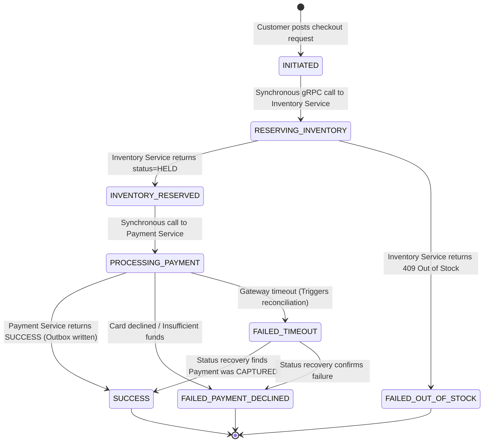
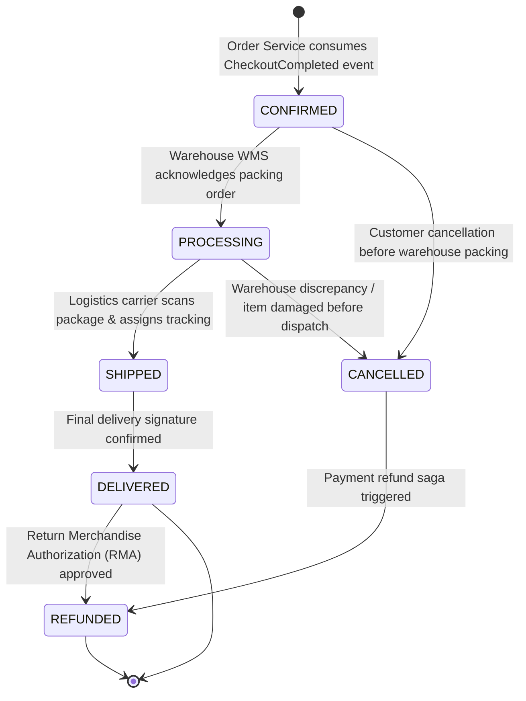
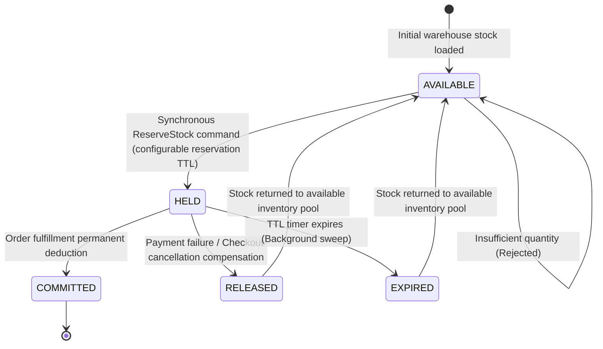
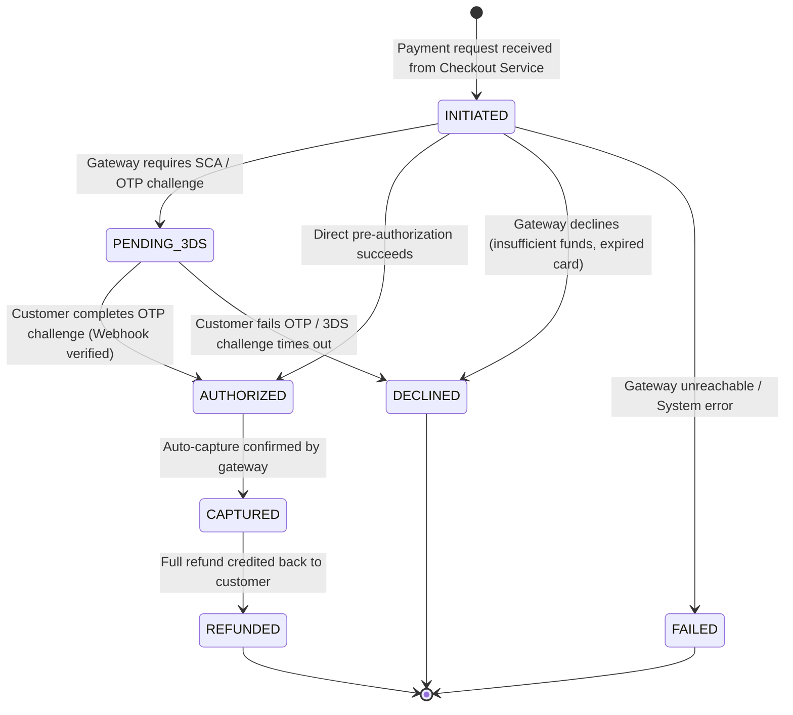

# 03_LLD: Core Lifecycle State Machine Diagrams

## 1. Overview & Domain State Separation
To maintain strict alignment with the **Member 1 High-Level Architecture Contract**, state lifecycles are decoupled across clear domain ownership boundaries:
1. **`CheckoutAttempt` Lifecycle (Checkout Service)**: Tracks the transient, synchronous checkout orchestration states (`INITIATED`, `RESERVING_INVENTORY`, `INVENTORY_RESERVED`, `PROCESSING_PAYMENT`, `SUCCESS`, `FAILED_*`).
2. **`Order` Lifecycle (Order Service)**: Begins **after** the `CheckoutCompleted` event is consumed asynchronously. Governs post-purchase states (`CONFIRMED`, `PROCESSING`, `SHIPPED`, `DELIVERED`, `CANCELLED`).
3. **`Reservation` Lifecycle (Inventory Service)**: Authoritative lifecycle of inventory holds (`HELD`, `COMMITTED`, `RELEASED`, `EXPIRED`).
4. **`PaymentTransaction` Lifecycle (Payment Service)**: Authoritative financial lifecycle (`INITIATED`, `PENDING_3DS`, `AUTHORIZED`, `CAPTURED`, `DECLINED`, `FAILED`, `REFUNDED`).

---

## 2. CheckoutAttempt State Machine (Checkout Service)

### Transition Table: CheckoutAttempt

| Current State | Trigger Event | Next State | Associated Action |
| :--- | :--- | :--- | :--- |
| `INITIATED` | `START_CHECKOUT` | `RESERVING_INVENTORY` | Dispatches synchronous reservation request to Inventory Service. |
| `RESERVING_INVENTORY` | `STOCK_HELD` | `INVENTORY_RESERVED` | Records temporary `reservation_id` (configurable reservation TTL). |
| `RESERVING_INVENTORY` | `STOCK_UNAVAILABLE` | `FAILED_OUT_OF_STOCK` | Returns HTTP 409 Conflict to client immediately. |
| `INVENTORY_RESERVED` | `DISPATCH_PAYMENT` | `PROCESSING_PAYMENT` | Sends synchronous charge payload to Payment Service. |
| `PROCESSING_PAYMENT` | `PAYMENT_ACK_SUCCESS` | `SUCCESS` | Atomic local DB commit: updates attempt & writes `CheckoutCompleted` to Outbox. |
| `PROCESSING_PAYMENT` | `PAYMENT_DECLINED` | `FAILED_PAYMENT_DECLINED` | Compensates: calls Inventory Service to release stock reservation. |
| `PROCESSING_PAYMENT` | `NETWORK_TIMEOUT` | `FAILED_TIMEOUT` | Initiates reconciliation query against Payment Service. |

---

## 3. Order Lifecycle State Machine (Order Service)

The Order aggregate lifecycle starts **asynchronously** when the Order Service consumes `CheckoutCompleted` from the Message Broker.

### Transition Table: Order Entity

| Current State | Trigger Event | Guard Condition | Next State | Associated Action |
| :--- | :--- | :--- | :--- | :--- |
| *None* | `CONSUME_CHECKOUT_COMPLETED` | Event valid & not already processed | `CONFIRMED` | Persists Order in `orders_db`; publishes `OrderConfirmed` to Broker. |
| `CONFIRMED` | `WAREHOUSE_DISPATCH_ACK` | Logistics slot assigned | `PROCESSING` | Emits packing slip to Warehouse Management System. |
| `PROCESSING` | `PACKAGE_SCANNED` | Tracking number assigned | `SHIPPED` | Sends tracking email to customer via Notification Service. |
| `SHIPPED` | `DELIVERY_CONFIRMED` | Carrier delivery webhook received | `DELIVERED` | Closes fulfillment lifecycle. |
| `CONFIRMED` | `CUSTOMER_CANCEL` | Order not yet picked | `CANCELLED` | Publishes `OrderCancelledEvent` to trigger payment refund. |

---

## 4. Inventory Reservation State Machine (Inventory Service)

Inventory Service is the **sole authoritative owner** of stock quantities and reservation lifecycles.

### Transition Table: Inventory Reservation

| Current State | Trigger Event | Guard Condition | Next State | Associated Action |
| :--- | :--- | :--- | :--- | :--- |
| `AVAILABLE` | `RESERVE_COMMAND` | `requested_qty <= available_stock` | `HELD` | Decrements available count, creates reservation record with configurable reservation TTL. |
| `HELD` | `COMMIT_COMMAND` | Valid active reservation | `COMMITTED` | Permanently increments ledger deductions; deletes hold record. |
| `HELD` | `RELEASE_COMMAND` | Compensation triggered | `RELEASED` | Increments available count; marks reservation as released. |
| `HELD` | `TTL_EXPIRED` | Current timestamp > `expires_at` | `EXPIRED` | Authoritative background sweep returns units to available pool. |

---

## 5. Payment Transaction State Machine (Payment Service)

Payment Service is the **sole authoritative owner** of financial transaction lifecycles.

### Transition Table: Payment Transaction

| Current State | Trigger Event | Guard Condition | Next State | Associated Action |
| :--- | :--- | :--- | :--- | :--- |
| `INITIATED` | `EXECUTE_CHARGE` | Valid token & non-zero amount | `AUTHORIZED` | Records gateway reference; holds customer funds. |
| `INITIATED` | `3DS_REQUIRED` | Gateway returns challenge URL | `PENDING_3DS` | Emits challenge redirect URL back to Checkout Service. |
| `PENDING_3DS` | `WEBHOOK_CONFIRMED` | Verified HMAC gateway signature | `AUTHORIZED` | Updates transaction; settles funds. |
| `AUTHORIZED` | `CAPTURE_SUCCESS` | Gateway acknowledges settlement | `CAPTURED` | Settles transaction; returns synchronous `SUCCESS` to Checkout. |
| `CAPTURED` | `REFUND_REQUESTED` | Amount <= captured amount | `REFUNDED` | Transmits refund API call to external gateway. |
