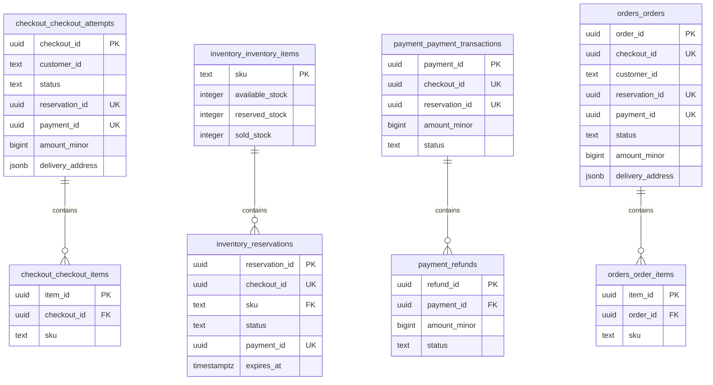
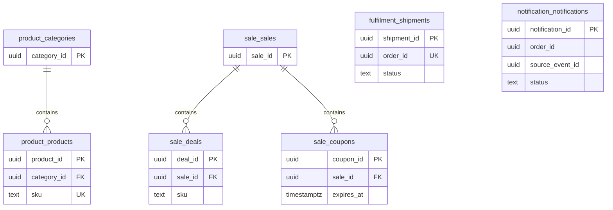

# 1. Entity-Relationship diagram

The critical diagram shows service-owned tables; solid edges are SQL foreign keys only. Table prefixes are schema owners. The schema enforces at most one item per checkout/order for the demo, even though the general collection relationship is shown as one-to-many. Supporting tables are in the second diagram. Operational outbox/idempotency tables are documented in the data dictionary.

## Cross-service logical references (no foreign keys)

| Source field | Target | Reason |
|---|---|---|
| reservations.checkout_id | checkout_attempts.checkout_id | Reservation correlation |
| payment_transactions.checkout_id | checkout_attempts.checkout_id | One payment intent per checkout |
| payment_transactions.reservation_id | reservations.reservation_id | Payment for the held unit |
| reservations.payment_id | payment_transactions.payment_id | Committed payment binding |
| orders.checkout_id | checkout_attempts.checkout_id | Deduplicate order creation |
| orders.payment_id / reservation_id | Payment / Inventory | Trace committed purchase |
| sku across services | product.products.sku | Stable catalogue identifier |
| shipments.order_id / notifications.order_id | orders.orders.order_id | Fulfilment and communication |
| customer_id | Identity provider subject | Authenticated identity |

## Supporting domains

