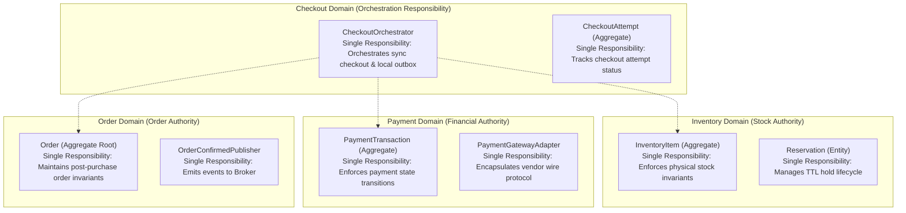
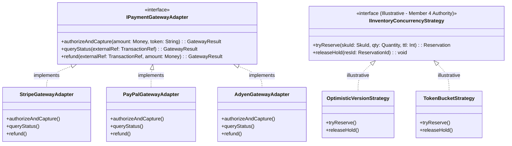
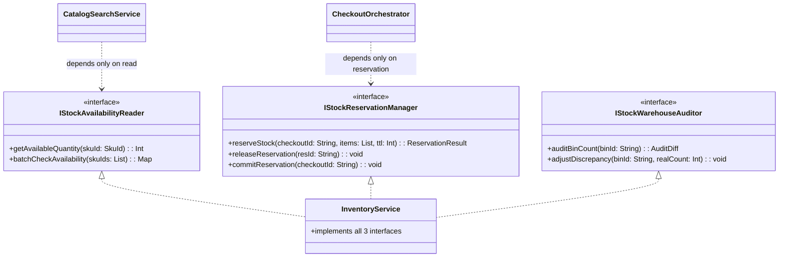
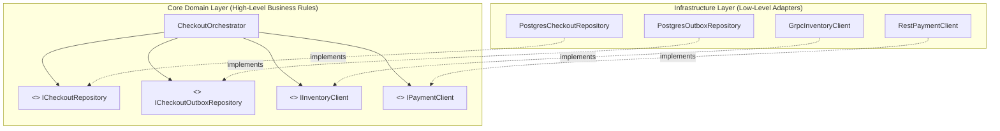

# 06_SOLID: SOLID Principles Implementation Mapping

## 1. Executive Summary
This document maps all **5 SOLID Principles** directly to the object models and service boundaries established in the **Member 1 High-Level Architecture Contract**.

The core architectural boundaries reinforced throughout this mapping:
* **Checkout Service**: Orchestrates the purchase flow and owns its local outbox.
* **Inventory Service**: Sole authoritative owner of stock and reservation state.
* **Payment Service**: Sole authoritative owner of financial transaction state.
* **Order Service**: Sole authoritative owner of order lifecycle creation and post-purchase management.

---

## 2. Principle 1: Single Responsibility Principle (SRP)

> *"A class should have one, and only one, reason to change."*

### Anti-Pattern Avoided: The God Order Service
In monolithic architectures, the `OrderService` frequently attempts to:
1. Handle checkout requests from the web client.
2. Deduct and lock inventory across warehouse databases.
3. Make direct HTTP calls to Stripe/Adyen SDKs.
4. Manage database connections and transactions.
5. Create packing slips and dispatch email notifications.

This creates severe coupling where an external payment gateway update or a tax rule modification forces changes and regressions in the core order fulfillment module.

### Architectural Alignment



* **`CheckoutOrchestrator`**: Single reason to change — changes to the checkout orchestration sequence, timeout thresholds, or local outbox emission rules.
* **`CheckoutAttempt`**: Single reason to change — changes to transient checkout attempt validation rules.
* **`InventoryItem` & `Reservation`**: Single reason to change — changes to stock accounting and hold invariant rules.
* **`PaymentTransaction`**: Single reason to change — changes to financial settlement lifecycles and compliance audits.
* **`Order` (Aggregate Root)**: Single reason to change — changes to post-purchase fulfillment invariants (item lines, cancellations, shipping address updates).

---

## 3. Principle 2: Open/Closed Principle (OCP)

> *"Software entities should be open for extension, but closed for modification."*

### Architectural Implementation: Gateway & Strategy Abstractions
Our architecture applies OCP across external integrations and concurrency controls using polymorphic interfaces.



* **Payment Provider Extension**: Integrating a new payment rail (e.g., Apple Pay, Klarna BNPL) requires creating a new class implementing `IPaymentGatewayAdapter`. The `PaymentService` and `PaymentTransaction` domain logic remain closed for modification.
* **Inventory Concurrency Extension**: The `IInventoryConcurrencyStrategy` interface permits testing different locking approaches (*illustrative alternatives; final concurrency mechanism is defined by Member 4*) without modifying the core `InventoryService`.

---

## 4. Principle 3: Liskov Substitution Principle (LSP)

> *"Objects of a superclass should be replaceable with objects of a subclass without altering the correctness of the program."*

### Anti-Pattern Avoided: The Unsupported Method Exception
If a specialized payment adapter throws `new UnsupportedOperationException("Pre-authorization not supported")` when invoked by the `PaymentService`, it violates LSP and causes unpredictable runtime failures.

### Architectural Implementation
* All implementations of `IPaymentGatewayAdapter` (`StripeGatewayAdapter`, `AdyenGatewayAdapter`, `PayPalGatewayAdapter`) strictly satisfy the contract.
* If a payment provider uses an alternative settlement workflow, the adapter internally normalizes the response into standard domain objects (`GatewayResult.success()`, `GatewayResult.declined()`), ensuring that any gateway adapter can be substituted interchangeably at runtime.
* The `PaymentService` interacts with `IPaymentGatewayAdapter` without needing `instanceof` checks or vendor-specific branching.

---

## 5. Principle 4: Interface Segregation Principle (ISP)

> *"Clients should not be forced to depend upon interfaces that they do not use."*

### Architectural Implementation: Lean, Client-Specific Ports



* **Client `CheckoutOrchestrator`** depends strictly on `IStockReservationManager`. It cannot see and cannot call warehouse auditing or replenishment methods.
* **Client `CatalogService`** depends strictly on `IStockAvailabilityReader` for fast cached availability reads.
* **Warehouse Staff UI** depends on `IStockWarehouseAuditor`. Changes to bin audit signatures have zero impact on the checkout flow.

---

## 6. Principle 5: Dependency Inversion Principle (DIP)

> *"High-level modules should not depend upon low-level modules. Both should depend upon abstractions."*

### Architectural Implementation: Hexagonal Clean Ports & Inversion of Control
Neither `CheckoutOrchestrator` nor `OrderService` depends on concrete database drivers, message broker SDKs, or third-party HTTP clients.



### Constructor Injection & Decoupled Ownership
```typescript
export class CheckoutOrchestrator {
  constructor(
    private readonly checkoutRepo: ICheckoutRepository,
    private readonly outboxRepo: ICheckoutOutboxRepository,
    private readonly inventoryClient: IInventoryClient, // gRPC Port
    private readonly paymentClient: IPaymentClient      // REST Port
  ) {}

  public async executeCheckout(command: CheckoutCommand): Promise<CheckoutResult> {
    // 1. Initialize attempt
    const attempt = CheckoutAttempt.create(command.idempotencyKey, command.amount);
    await this.checkoutRepo.save(attempt);

    // 2. Synchronous Inventory Hold (using configurable reservation TTL)
    const res = await this.inventoryClient.reserve(attempt.getId(), command.items, command.reservationTtl);
    if (!res.isSuccess()) {
      attempt.markFailed(CheckoutStatus.FAILED_OUT_OF_STOCK, "Out of stock");
      await this.checkoutRepo.save(attempt);
      return CheckoutResult.failed(CheckoutStatus.FAILED_OUT_OF_STOCK);
    }

    // 3. Synchronous Payment Decision
    const pay = await this.paymentClient.processPayment(attempt.getId(), command.amount, command.paymentToken);
    if (!pay.isSuccess()) {
      attempt.markFailed(CheckoutStatus.FAILED_PAYMENT_DECLINED, pay.getErrorMessage());
      await this.checkoutRepo.save(attempt);
      // Compensate: release stock hold
      await this.inventoryClient.release(res.getReservationId());
      return CheckoutResult.failed(CheckoutStatus.FAILED_PAYMENT_DECLINED);
    }

    // 4. Atomic Local Outbox Write
    attempt.markSuccess(pay.getTransactionId());
    await this.checkoutRepo.save(attempt);
    await this.outboxRepo.saveOutboxEvent(new CheckoutCompletedEvent(attempt.getId(), command.customerId));

    return CheckoutResult.success(attempt.getId());
  }
}
```

* **No Cross-Database Coupling**: The `CheckoutOrchestrator` communicates with Inventory and Payment exclusively via `IInventoryClient` and `IPaymentClient` ports. It has **zero direct access** to `inventory_db` or `payments_db`.
* **Testing Isolation**: The checkout orchestrator can be thoroughly unit-tested using mock clients with zero live database or network dependencies.
