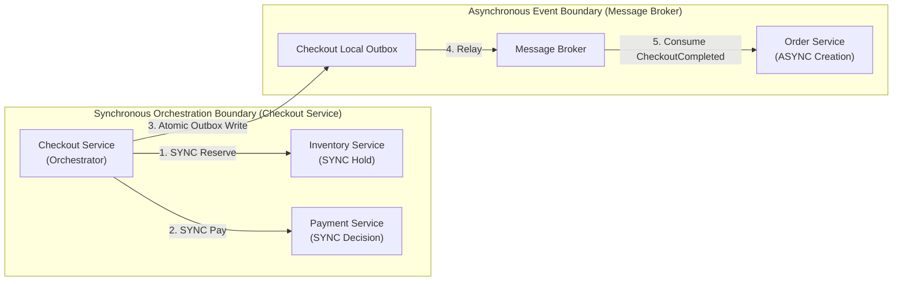
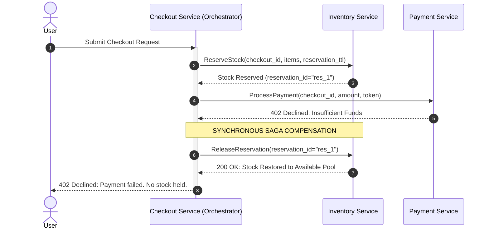

# 07_Design_Patterns: The Saga & Compensation Pattern

## 1. Architectural Motivation & Scope
In the **Member 1 High-Level Architecture**, the purchase flow spans multiple microservices with independent databases:
* **Checkout Service** (`checkout_db`)
* **Inventory Service** (`inventory_db`)
* **Payment Service** (`payments_db`)
* **Order Service** (`orders_db`)

Traditional distributed Two-Phase Commit (2PC) is strictly avoided because it creates blocking locks across network boundaries, reduces availability, and introduces coordinator single-points-of-failure. 

Instead, the system relies on **Checkout-Led Orchestration** along the synchronous critical path paired with **Compensating Transactions** and **Asynchronous Eventual Consistency** via the Transactional Outbox.

---

## 2. Orchestration vs. Choreography Boundary



* **No Competing Orchestrators**: The **Checkout Service** is the sole orchestrator of the critical purchase path. The **Order Service does not orchestrate checkout**; it acts as an asynchronous consumer that creates the permanent `Order` aggregate once `CheckoutCompleted` is published.
* **Deterministic Compensation**: If any synchronous step fails prior to the outbox write, the Checkout Service coordinates immediate compensation (releasing the inventory hold).

---

## 3. Checkout Execution & Compensation Lifecycle

| Phase / Step | Service | Forward Action | Compensating Action (Rollback / Recovery) | Guarantees |
| :---: | :--- | :--- | :--- | :---: |
| **S1** | **Checkout Service** | Record `CheckoutAttempt(status=INITIATED)` | Mark `CheckoutAttempt(status=CANCELLED)` | Idempotent via `Idempotency-Key` |
| **S2** | **Inventory Service** | Reserve stock (`HELD`, configurable reservation TTL) | Release stock hold (`POST /v1/inventory/release`) | Authoritative ownership in Inventory |
| **S3** | **Payment Service** | Authorize & capture charge synchronously | Void authorization or issue refund (`POST /v1/payments/refund`) | Authoritative ownership in Payment |
| **S4** | **Checkout Service** | *Pivot Boundary*: Update attempt to `SUCCESS` and atomically write `CheckoutCompleted` to local outbox. | *Beyond this pivot point, the checkout cannot fail*. Subsequent failures are resolved asynchronously. | Local ACID commit (No 2PC) |
| **S5** | **Order Service** | Asynchronously consume `CheckoutCompleted` and persist `Order`. | Handled via dead-letter queue (DLQ) retry; order creation is guaranteed eventual consistency. | Idempotent on `checkout_id` |

---

## 4. Failure Scenarios & Compensation Flows

### 4.1. Scenario A: Immediate Payment Failure (Synchronous Rollback)
When the customer submits payment details but the card is declined:
1. `PaymentService` returns synchronous decline (`402 Payment Required`).
2. `CheckoutOrchestrator` catches the decline response.
3. **Compensation Triggered**: `CheckoutOrchestrator` invokes `InventoryService.releaseReservation(reservation_id)`.
4. `InventoryService` restores the held stock back to the available pool.
5. `CheckoutAttempt` is marked `FAILED_PAYMENT_DECLINED`.
6. Client receives an immediate decline error without any dangling reservation.



---

### 4.2. Scenario B: Payment Success + Checkout Crash (Reconciliation Recovery)
Member 1 explicitly identifies the failure window where Payment succeeds, but Checkout crashes before writing `CheckoutCompleted` to its outbox:
1. `PaymentService` durably records `status='CAPTURED'` in its local `payments_db`.
2. The Checkout node crashes due to an infrastructure outage before writing to `checkout_outbox`.
3. When the customer retries with the same `Idempotency-Key` (or when a background Checkout Recovery Worker audits pending attempts):
   * Checkout identifies an unsettled attempt in `PROCESSING_PAYMENT` state.
   * Checkout executes a reconciliation query: `PaymentService.getPaymentStatus(checkout_id)`.
   * `PaymentService` returns verified `SUCCESS` with the transaction reference.
   * Checkout resumes its local transaction: updates `CheckoutAttempt` to `SUCCESS` and atomically writes `CheckoutCompleted` to its local Transactional Outbox.
   * The Outbox Relay publishes the event to the Message Broker, and the Order Service asynchronously creates the Order.
4. **Zero Distributed 2PC**: Both services maintain strict, isolated local database transactions.

---

### 4.3. Scenario C: Late / Asynchronous Payment Failure
For payment methods requiring asynchronous settlement (e.g., bank transfers or 3D-Secure webhooks):
1. If the external gateway asynchronously fails settlement after a hold was placed:
2. `PaymentService` marks the transaction `FAILED` and publishes `PaymentFailedEvent` to the Message Broker.
3. `InventoryService` consumes `PaymentFailedEvent` and authoritatively releases the associated reservation.
4. `CheckoutService` marks the attempt as expired or failed.

---

## 5. Checkout Orchestration & Compensation Logic

```typescript
export class CheckoutOrchestrator {
  constructor(
    private readonly checkoutRepo: ICheckoutRepository,
    private readonly outboxRepo: ICheckoutOutboxRepository,
    private readonly inventoryClient: IInventoryClient,
    private readonly paymentClient: IPaymentClient
  ) {}

  public async executeCheckout(command: CheckoutCommand): Promise<CheckoutResult> {
    // Step 1: Idempotent attempt initialization
    const existing = await this.checkoutRepo.findByIdempotencyKey(command.idempotencyKey);
    if (existing) {
      if (existing.isCompleted()) return CheckoutResult.success(existing.getId());
      return this.handleRecovery(existing);
    }

    const attempt = CheckoutAttempt.create(command.idempotencyKey, command.amount);
    await this.checkoutRepo.save(attempt);

    // Step 2: Synchronous Inventory Reservation (using configurable reservation TTL)
    const invResult = await this.inventoryClient.reserve(attempt.getId(), command.items, command.reservationTtl);
    if (!invResult.isSuccess()) {
      attempt.markFailed(CheckoutStatus.FAILED_OUT_OF_STOCK, "Insufficient stock");
      await this.checkoutRepo.save(attempt);
      return CheckoutResult.failed(CheckoutStatus.FAILED_OUT_OF_STOCK);
    }
    attempt.markStockReserved(invResult.getReservationId());
    await this.checkoutRepo.save(attempt);

    // Step 3: Synchronous Payment Decision
    const payResult = await this.paymentClient.processPayment(
      attempt.getId(),
      command.amount,
      command.paymentToken
    );

    if (!payResult.isSuccess()) {
      // Step 3b: Immediate Compensation on Payment Failure
      attempt.markFailed(CheckoutStatus.FAILED_PAYMENT_DECLINED, payResult.getErrorMessage());
      await this.checkoutRepo.save(attempt);
      await this.inventoryClient.release(invResult.getReservationId());
      return CheckoutResult.failed(CheckoutStatus.FAILED_PAYMENT_DECLINED);
    }

    // Step 4: Pivot Point - Local Atomic Outbox Commit
    attempt.markSuccess(payResult.getTransactionId());
    await this.checkoutRepo.save(attempt);
    await this.outboxRepo.saveOutboxEvent(
      new CheckoutCompletedEvent(attempt.getId(), command.customerId, command.items, command.amount)
    );

    return CheckoutResult.success(attempt.getId());
  }

  /**
   * Recovery handler for Payment Success + Checkout Crash window
   */
  public async handleRecovery(attempt: CheckoutAttempt): Promise<CheckoutResult> {
    const paymentStatus = await this.paymentClient.getPaymentStatus(attempt.getId());
    if (paymentStatus.isSuccess()) {
      // Resume local outbox write
      attempt.markSuccess(paymentStatus.getTransactionId());
      await this.checkoutRepo.save(attempt);
      await this.outboxRepo.saveOutboxEvent(
        new CheckoutCompletedEvent(attempt.getId(), attempt.getCustomerId(), attempt.getItems(), attempt.getAmount())
      );
      return CheckoutResult.success(attempt.getId());
    } else {
      // Release held reservation if payment did not succeed
      if (attempt.getReservationId()) {
        await this.inventoryClient.release(attempt.getReservationId()!);
      }
      attempt.markFailed(CheckoutStatus.FAILED_PAYMENT_DECLINED, "Payment not settled");
      await this.checkoutRepo.save(attempt);
      return CheckoutResult.failed(CheckoutStatus.FAILED_PAYMENT_DECLINED);
    }
  }
}
```
