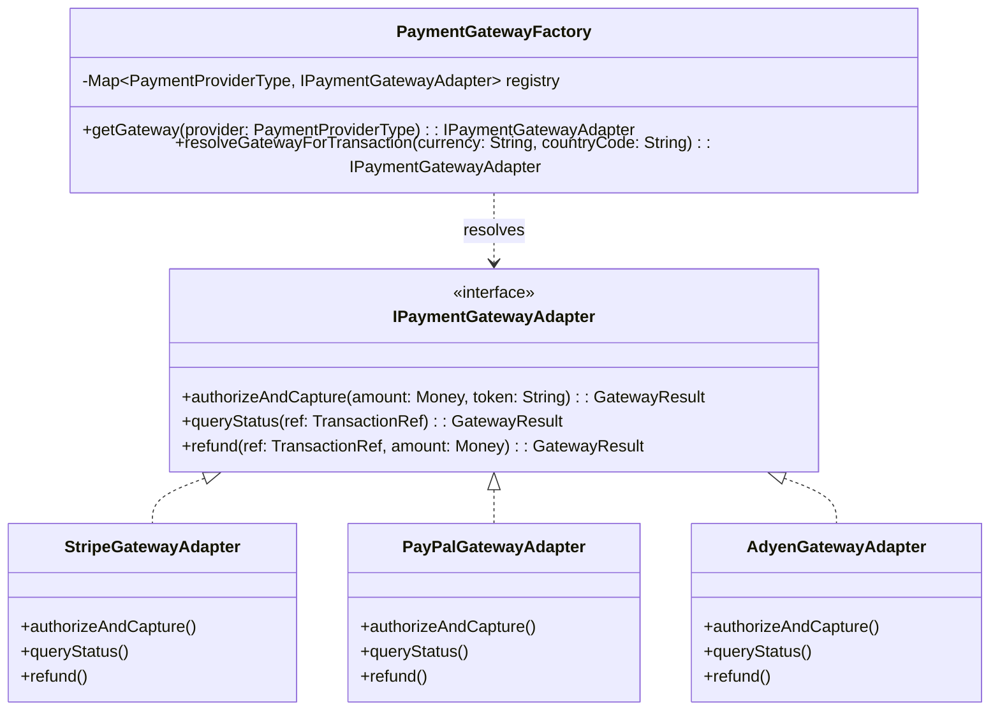

# 07_Design_Patterns: The Factory Pattern (Object Creation)

## 1. Motivation & Architectural Need
In complex e-commerce architectures, direct instantiation of entities and external adapters via the `new` operator leads to severe code smell, tight coupling, and leaky domain boundaries:
1. **Payment Gateway Instantiation**: The Payment Service must route transactions to different third-party payment gateways (Stripe, PayPal, Adyen) dynamically based on currency, customer geolocation, and transaction characteristics.
2. **Order Aggregate Construction**: The Order Service constructs the permanent `Order` aggregate asynchronously upon consuming the `CheckoutCompleted` event. Constructing an aggregate with nested `OrderItem` entities, delivery value objects, and snapshot price guarantees requires centralized encapsulation.

To solve these challenges, we implement:
* **The Gateway Factory Pattern** for dynamic payment adapter resolution.
* **The Aggregate Factory Pattern** for invariant-preserving Order creation from `CheckoutCompleted` events.

---

## 2. Payment Gateway Factory Architecture



### Implementation Logic: Parameterized Gateway Factory
```typescript
export enum PaymentProviderType {
  STRIPE = "STRIPE",
  PAYPAL = "PAYPAL",
  ADYEN = "ADYEN"
}

export class PaymentGatewayFactory {
  private readonly gatewayRegistry: Map<PaymentProviderType, IPaymentGatewayAdapter> = new Map();

  constructor(
    stripeAdapter: StripeGatewayAdapter,
    payPalAdapter: PayPalGatewayAdapter,
    adyenAdapter: AdyenGatewayAdapter
  ) {
    this.gatewayRegistry.set(PaymentProviderType.STRIPE, stripeAdapter);
    this.gatewayRegistry.set(PaymentProviderType.PAYPAL, payPalAdapter);
    this.gatewayRegistry.set(PaymentProviderType.ADYEN, adyenAdapter);
  }

  public getGateway(provider: PaymentProviderType): IPaymentGatewayAdapter {
    const gateway = this.gatewayRegistry.get(provider);
    if (!gateway) {
      throw new UnsupportedProviderException(`Payment provider ${provider} not registered`);
    }
    return gateway;
  }

  /**
   * Dynamic Routing Factory: Chooses best gateway based on localized cost/compliance
   */
  public resolveGateway(currency: string, countryIso: string): IPaymentGatewayAdapter {
    // European SEPA / iDeal routed to Adyen for lowest interchange fee
    if (["EUR", "GBP"].includes(currency) && ["DE", "NL", "FR", "GB"].includes(countryIso)) {
      return this.getGateway(PaymentProviderType.ADYEN);
    }
    // North American USD / CAD routed to Stripe for highest auth conversion rate
    if (["USD", "CAD"].includes(currency)) {
      return this.getGateway(PaymentProviderType.STRIPE);
    }
    // Global fallback
    return this.getGateway(PaymentProviderType.STRIPE);
  }
}
```

---

## 3. Order Aggregate Factory Architecture (Asynchronous Creation)

### Motivation & Domain Responsibility
The **Order Service** receives a `CheckoutCompletedEvent` asynchronously from the Message Broker. The `OrderFactory` encapsulates the transformation of this event into a fully formed, invariant-validated `Order` aggregate before persistence.

```mermaid
graph LR
    Event["CheckoutCompletedEvent<br/>(from Message Broker)"]
    Consumer["OrderEventConsumer"]
    OrderFactory["OrderFactory"]
    OrderAggregate["Order (Aggregate Root)"]
    OrderItems["OrderItems (Entities)"]

    Event --> Consumer
    Consumer --> OrderFactory
    OrderFactory -->|Validates Invariants & Constructs| OrderAggregate
    OrderAggregate *-- OrderItems
```

### Implementation Logic: OrderFactory
```typescript
export interface CheckoutCompletedPayload {
  checkoutId: string;
  customerId: string;
  items: Array<{ skuId: string; quantity: number; unitPrice: number }>;
  shippingAddress: {
    street: string;
    city: string;
    state: string;
    postalCode: string;
    countryIso: string;
  };
  totalAmount: number;
}

export class OrderFactory {
  public createOrderFromEvent(payload: CheckoutCompletedPayload): Order {
    // 1. Invariant Validation
    if (!payload.items || payload.items.length === 0) {
      throw new DomainValidationException("An order must contain at least one item.");
    }

    // 2. Value Object Construction
    const orderId = OrderId.generate(); // Generates time-sortable UUIDv7
    const deliveryAddress = new DeliveryAddress(
      payload.shippingAddress.street,
      payload.shippingAddress.city,
      payload.shippingAddress.state,
      payload.shippingAddress.postalCode,
      payload.shippingAddress.countryIso
    );

    // 3. Line Items Creation with Immutable Price Snapshots
    const orderItems: OrderItem[] = payload.items.map((item) => {
      if (item.quantity <= 0) {
        throw new DomainValidationException(`Quantity for SKU ${item.skuId} must be positive.`);
      }
      return new OrderItem(
        Uuid.generate(),
        new SkuId(item.skuId),
        new Quantity(item.quantity),
        Money.of(item.unitPrice, "USD")
      );
    });

    // 4. Instantiation of Aggregate Root with Initial Post-Purchase State
    return new Order(
      orderId,
      payload.checkoutId,
      payload.customerId,
      OrderStatus.CONFIRMED,
      orderItems,
      deliveryAddress,
      Money.of(payload.totalAmount, "USD"),
      new Date() // confirmedAt
    );
  }
}
```

---

## 4. Key Architectural Benefits
1. **Encapsulation of Invariants**: Ensures incomplete or unvalidated orders can never be instantiated.
2. **Clear Boundary Separation**: Order creation logic remains completely decoupled from checkout orchestration and payment gateway drivers.
3. **Extensibility**: Adding new regional gateway providers or order types does not require modifying core domain services.
