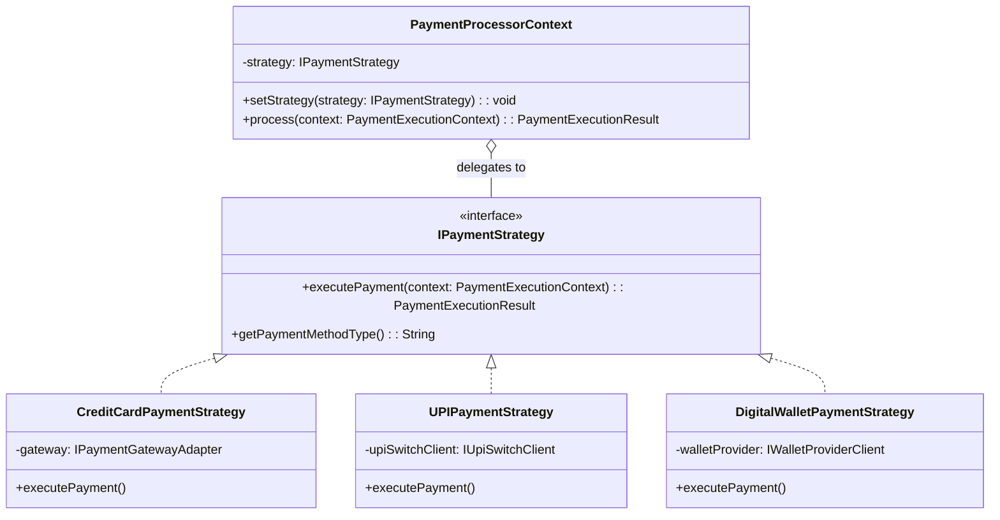
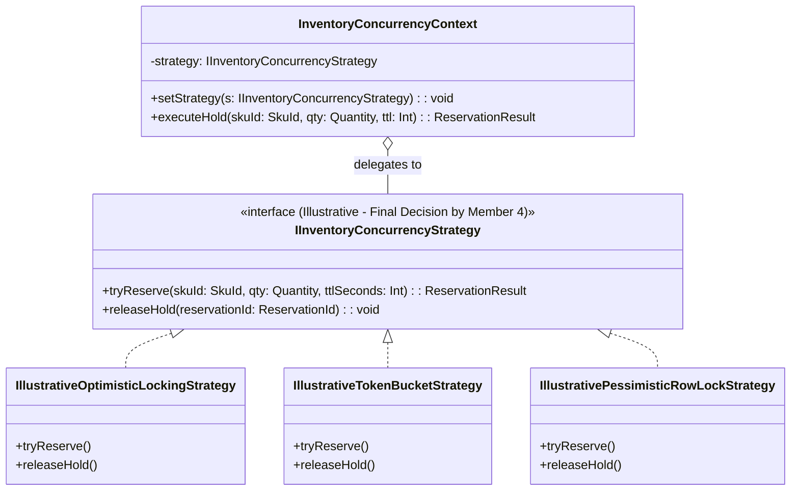

# 07_Design_Patterns: The Strategy Pattern (Interchangeable Algorithms)

## 1. Architectural Motivation & Scope
In a distributed microservice system, business algorithms and technical execution mechanisms vary across payment rails and concurrency environments:
1. **Payment Methods**: Credit cards require 3DS redirection and PAN tokenization; UPI requires VPA collect requests; Digital Wallets require cryptographic payload unwrapping.
2. **Inventory Concurrency Control**: Different locking strategies may be evaluated to prevent overselling while maximizing throughput.

The **Strategy Pattern** encapsulates these algorithms behind uniform interfaces, allowing runtime swapping and clear separation of concerns.

> [!IMPORTANT]
> **Member 4 Authority Boundary**: The inventory concurrency strategies documented below represent **illustrative alternatives to demonstrate object-oriented flexibility**. The final production concurrency-control mechanism and infrastructure benchmarking are explicitly governed by **Member 4**.

---

## 2. Strategy 1: Payment Method Processing Strategies



### Implementation Logic: Payment Strategies
```typescript
export interface PaymentExecutionContext {
  checkoutId: string;
  amount: Money;
  customerId: string;
  metadata: Record<string, any>;
}

export interface IPaymentStrategy {
  getPaymentMethodType(): string;
  executePayment(context: PaymentExecutionContext): Promise<PaymentExecutionResult>;
}

// 1. Credit Card Strategy (Tokenized, 3DS capable)
export class CreditCardPaymentStrategy implements IPaymentStrategy {
  constructor(private readonly gateway: IPaymentGatewayAdapter) {}

  public getPaymentMethodType(): string {
    return "CREDIT_CARD";
  }

  public async executePayment(context: PaymentExecutionContext): Promise<PaymentExecutionResult> {
    const cardToken = context.metadata["cardToken"];
    if (!cardToken) throw new InvalidPayloadException("Card token is missing");

    const chargeResult = await this.gateway.authorizeAndCapture(
      context.amount,
      cardToken,
      context.checkoutId
    );

    if (chargeResult.requiresAction) {
      return PaymentExecutionResult.requiresRedirect(chargeResult.redirectUrl);
    }
    return PaymentExecutionResult.success(chargeResult.transactionId);
  }
}

// 2. UPI Strategy (VPA & Collect Request)
export class UPIPaymentStrategy implements IPaymentStrategy {
  constructor(private readonly upiClient: IUpiSwitchClient) {}

  public getPaymentMethodType(): string {
    return "UPI";
  }

  public async executePayment(context: PaymentExecutionContext): Promise<PaymentExecutionResult> {
    const vpa = context.metadata["vpa"];
    const collectRes = await this.upiClient.initiateCollect(vpa, context.amount.getAmount(), context.checkoutId);
    return PaymentExecutionResult.pendingApproval(collectRes.referenceId);
  }
}

// 3. Payment Context (Runtime Resolution)
export class PaymentProcessorContext {
  private strategy?: IPaymentStrategy;

  public setStrategy(strategy: IPaymentStrategy): void {
    this.strategy = strategy;
  }

  public async execute(context: PaymentExecutionContext): Promise<PaymentExecutionResult> {
    if (!this.strategy) throw new IllegalStateException("Payment strategy not initialized.");
    return await this.strategy.executePayment(context);
  }
}
```

---

## 3. Strategy 2: Inventory Concurrency Strategies (Illustrative Alternatives)

### Architectural Guarantee
* **Authority**: The **Inventory Service** is the sole authoritative owner of reservation state.
* **Invariant**: No more than the physical/configured units (e.g., 100 units during flash sales) can be successfully reserved under concurrent load.
* **Delegation**: The strategies below illustrate the object-oriented decoupling; **Member 4 defines the final production concurrency strategy**.



### Illustrative Strategy Variations

| Illustrative Alternative | Conceptual Mechanism | Characteristics (Illustrative) | Architectural Status |
| :--- | :--- | :--- | :--- |
| **Strategy A: Optimistic Versioning** | Relational DB `@Version` column check | Low-overhead under low contention; collision retries under high concurrency. | *Illustrative Option (Member 4)* |
| **Strategy B: In-Memory Token Bucket** | Atomic decrement counter | Fast in-memory evaluation; relieves DB thread pools during flash spikes. | *Illustrative Option (Member 4)* |
| **Strategy C: Pessimistic Row Lock** | `SELECT ... FOR UPDATE` row lock | Strict serialization at the database layer; high lock contention under flash load. | *Illustrative Option (Member 4)* |

### Implementation Logic: Concurrency Strategy Context
```typescript
export interface IInventoryConcurrencyStrategy {
  tryReserve(skuId: string, quantity: number, ttlSeconds: number): Promise<ReservationResult>;
  releaseHold(reservationId: string): Promise<void>;
}

// Illustrative Strategy A: Optimistic Concurrency Control
export class IllustrativeOptimisticLockingStrategy implements IInventoryConcurrencyStrategy {
  constructor(private readonly db: RelationalDatabaseClient) {}

  public async tryReserve(skuId: string, qty: number, ttl: number): Promise<ReservationResult> {
    const item = await this.db.query("SELECT * FROM inventory WHERE sku_id = $1", [skuId]);
    if (item.available_stock < qty) return ReservationResult.outOfStock();

    const affected = await this.db.query(
      "UPDATE inventory SET reserved_stock = reserved_stock + $1, version = version + 1 " +
      "WHERE sku_id = $2 AND version = $3",
      [qty, skuId, item.version]
    );

    return affected.rowCount > 0 ? ReservationResult.held(Uuid.generate()) : ReservationResult.collisionRetry();
  }

  public async releaseHold(reservationId: string): Promise<void> {
    await this.db.query("UPDATE inventory SET reserved_stock = reserved_stock - $1 WHERE res_id = $2", [reservationId]);
  }
}

// Illustrative Strategy B: In-Memory Counter
export class IllustrativeTokenBucketStrategy implements IInventoryConcurrencyStrategy {
  constructor(private readonly cache: DistributedCacheClient) {}

  public async tryReserve(skuId: string, qty: number, ttl: number): Promise<ReservationResult> {
    const success = await this.cache.atomicDecrement(`stock:${skuId}`, qty);
    return success ? ReservationResult.held(Uuid.generate()) : ReservationResult.outOfStock();
  }

  public async releaseHold(reservationId: string): Promise<void> {
    await this.cache.atomicIncrement(`stock:${reservationId}`, 1);
  }
}
```

---

## 4. Key Architectural Benefits
1. **Separation of Policy and Mechanism**: High-level services remain agnostic to third-party payment rails and low-level concurrency algorithms.
2. **Adherence to OCP**: New payment methods or locking strategies can be plugged into the context without modifying business logic.
3. **Respect for Team Roles**: Allows Member 2 to deliver a robust object model while preserving Member 4's exclusive ownership over concurrency benchmarking.
